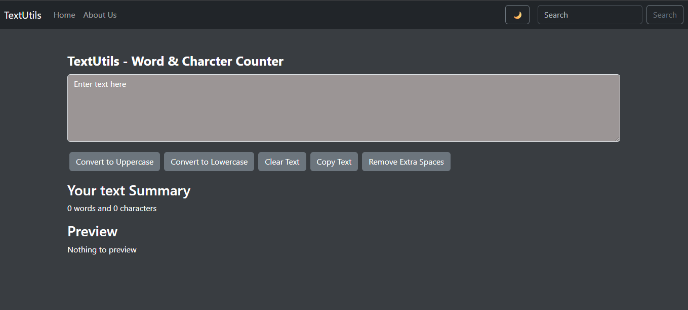

# 📝 TextUtils - React Text Utility App

TextUtils is a simple yet powerful React-based text utility app designed to help you quickly analyze and modify your text. It offers features like word count, character count, removing extra spaces, case conversions, clipboard support, and dark mode — all in a lightweight interface.

---

---

## 🚀 Features

- 🔠 Convert text to UPPERCASE and lowercase
- 🧹 Remove extra spaces
- 📋 Copy text to clipboard
- 🧼 Clear the text area instantly
- 🧮 Live word and character count
- 🌗 Light / Dark Mode toggle
- 📱 Responsive UI using React Bootstrap
- 🌐 Client-side routing with React Router

---

## 🛠️ Technologies Used

- [React](https://reactjs.org/)
- [React Router](https://reactrouter.com/)
- [Bootstrap](https://getbootstrap.com/)
- [React-Bootstrap](https://react-bootstrap.github.io/)
- [Vite](https://vitejs.dev/) for blazing-fast build setup
- [GitHub Pages](https://pages.github.com/) for deployment

---

## 🔗 Live Demo
[Click here to view the app](https://tannuu29.github.io/text-utils-app/)

---

## 📚 Learning Objective
This project was created to strengthen React fundamentals, including:

- Functional components
- State management with hooks
- Props and component reusability
- Routing with react-router-dom
- Theme switching
- Deployment using gh-pages

---

## Acknowledgements
- Inspired by React beginner projects and utility tools
- UI built with React Bootstrap for rapid styling
